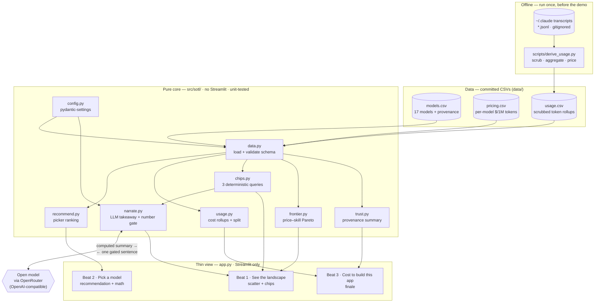

# Architecture — State of the LLMs

**Principle: pure core, thin view.** All logic lives in `src/sotl/` (UI-agnostic,
unit-tested, never imports Streamlit). `st.*` calls live *only* in `app.py`. Numbers are
computed in the core; the LLM only writes prose over already-computed values and can never
become a source of figures.

## How to read it

- **Offline (top):** `derive_usage.py` parses this Week-1 project's Claude Code
  transcripts, scrubs them to aggregates (no message content or paths — guardrail #4),
  prices them, and writes `data/usage.csv`. Raw `*.jsonl` is gitignored and never read at
  runtime, which keeps the demo deterministic.
- **Data:** three committed CSVs. Every model metric carries a `source_url` +
  `last_verified` date (guardrail #2).
- **Pure core:** `data.py` is the only loader (validates schema, fails loud). The other
  modules are pure functions over typed DataFrames — `recommend` (picker), `usage` (cost
  rollups + the input/output/cache split), `chips` (the 3 "ask the data" queries),
  `frontier` (the price–skill Pareto line), `trust` (provenance), and `narrate`.
- **The narration gate:** `narrate.py` sends the *computed* result to an open model and
  asks for one sentence, then validates every number in the reply against the input —
  any figure not in the source data is rejected and the deterministic line is shown
  instead (guardrail #3). The app renders fully with no API key.
- **Thin view:** `app.py` wires the core into the three-beat Streamlit story. It holds no
  business logic — only layout, widgets, and chart rendering.

See [`docs/decisions/`](decisions/) for the ADRs behind these choices.
